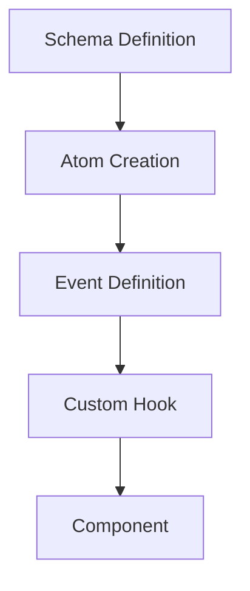

# Getting Started with Quantum Reactor Pattern

::: info What is Quantum Reactor?
The Quantum Reactor Pattern provides a comprehensive architectural approach to building React applications that are maintainable, testable, and scalable.
:::

## Prerequisites

Before you begin, ensure you have the following:

- Node.js 14.0+
- npm or yarn
- Familiarity with React and TypeScript

## Create a New Project

::: tip Fast Track
The easiest way to get started is using our CLI tool which sets up everything automatically.
:::

::: code-group

```bash [npm]
npm create quantum-reactor-app my-app
```

```bash [yarn]
yarn create quantum-reactor-app my-app
```

```bash [pnpm]
pnpm create quantum-reactor-app my-app
```

:::

This will set up a new project with all the necessary dependencies and the Quantum Reactor Pattern file structure.

## Manual Setup

::: details Manual Setup Instructions

If you prefer to set up manually or integrate into an existing project:

### 1. Create a new React project

::: code-group

```bash [npm]
npx create-react-app my-app --template typescript
```

```bash [yarn]
yarn create react-app my-app --template typescript
```

:::

### 2. Install the required dependencies

::: code-group

```bash [npm]
npm install recoil tailwindcss shadcn-ui @types/uuid uuid
```

```bash [yarn]
yarn add recoil tailwindcss shadcn-ui @types/uuid uuid
```

:::

### 3. Set up the project structure

```
/src
  /schema          # State definitions
  /quantum         # State management
    /atoms         # Base state atoms
    /selectors     # Derived state
    /events        # Event definitions & handlers
  /components      # Atomic design components
    /atoms         # Basic building blocks
    /molecules     # Simple combinations
    /organisms     # Complex compositions
    /templates     # Layout structures
    /pages         # Full page compositions
  /hooks           # Custom quantum hooks
  /utils           # Pure utility functions
```

:::

## The First Quantum Component

Let's create a simple counter component using the Quantum Reactor Pattern:

### Step 1: Create the schema

::: warning Schema First Development
In Quantum Reactor Pattern, we always start by defining our state schema before implementation.
:::

```typescript
// schema/CounterSchema.ts
export type CounterState = {
  count: number;
  history: number[];
};

export const initialCounterState: CounterState = {
  count: 0,
  history: []
};
```

### Step 2: Create the atom

```typescript
// quantum/atoms/counterAtom.ts
import { atom } from 'recoil';
import { CounterState, initialCounterState } from '../../schema/CounterSchema';

export const counterStateAtom = atom<CounterState>({
  key: 'counterState',
  default: initialCounterState,
});
```

### Step 3: Define events

::: tip Event Handler Pattern
Event handlers abstract state mutations, providing a clear interface between components and state logic.
:::

```typescript
// quantum/events/counterEvents.ts
import { useRecoilCallback } from 'recoil';
import { counterStateAtom } from '../atoms/counterAtom';

export type CounterEvent =
  | { type: 'INCREMENT' }
  | { type: 'DECREMENT' }
  | { type: 'RESET' };

export const useCounterEvents = () => {
  const dispatch = useRecoilCallback(
    ({ set, snapshot }) => async (event: CounterEvent) => {
      const currentState = await snapshot.getPromise(counterStateAtom);

      switch (event.type) {
        case 'INCREMENT':
          set(counterStateAtom, {
            count: currentState.count + 1,
            history: [...currentState.history, currentState.count]
          });
          break;

        case 'DECREMENT':
          set(counterStateAtom, {
            count: currentState.count - 1,
            history: [...currentState.history, currentState.count]
          });
          break;

        case 'RESET':
          set(counterStateAtom, {
            count: 0,
            history: [...currentState.history, currentState.count]
          });
          break;
      }
    },
    []
  );

  return dispatch;
};
```

### Step 4: Create a custom hook

::: tip Custom Hooks
Custom hooks create a clean API for components, abstracting state management and event handling.
:::

```typescript
// hooks/useCounter.ts
import { useRecoilValue } from 'recoil';
import { counterStateAtom } from '../quantum/atoms/counterAtom';
import { useCounterEvents } from '../quantum/events/counterEvents';

export const useCounter = () => {
  const { count, history } = useRecoilValue(counterStateAtom);
  const dispatch = useCounterEvents();

  return {
    count,
    history,
    increment: () => dispatch({ type: 'INCREMENT' }),
    decrement: () => dispatch({ type: 'DECREMENT' }),
    reset: () => dispatch({ type: 'RESET' }),
  };
};
```

### Step 5: Create a Counter component

```tsx
// components/molecules/Counter.tsx
import { useCounter } from '../../hooks/useCounter';
import { Button } from '@/components/ui/button'; // shadcn component

export const Counter = () => {
  const { count, increment, decrement, reset } = useCounter();

  return (
    <div className="flex flex-col items-center gap-4 p-4 border rounded-lg">
      <h2 className="text-2xl font-bold">{count}</h2>
      <div className="flex gap-2">
        <Button onClick={decrement}>-</Button>
        <Button onClick={reset} variant="outline">Reset</Button>
        <Button onClick={increment}>+</Button>
      </div>
    </div>
  );
};
```

### Step 6: Use it in your App

```tsx
// App.tsx
import { RecoilRoot } from 'recoil';
import { Counter } from './components/molecules/Counter';

export default function App() {
  return (
    <RecoilRoot>
      <div className="min-h-screen flex items-center justify-center">
        <Counter />
      </div>
    </RecoilRoot>
  );
}
```

## Quantum Component Lifecycle



## Next Steps

::: info Documentation Roadmap
Now that you've created your first Quantum Reactor component, continue exploring:
:::

<div class="custom-block next-steps">
  <div class="items">
    <div class="item">
      <a href="/guide/core-concepts">
        <h4>Core Concepts</h4>
        <p>Learn about the foundational principles of Quantum Reactor Pattern</p>
      </a>
    </div>
    <div class="item">
      <a href="/guide/directory-structure">
        <h4>Directory Structure</h4>
        <p>Understand the organization and layout of Quantum Reactor projects</p>
      </a>
    </div>
    <div class="item">
      <a href="/state-management/schema">
        <h4>Schema-First Development</h4>
        <p>Explore the methodology of starting with well-defined schemas</p>
      </a>
    </div>
    <div class="item">
      <a href="/components/overview">
        <h4>Atomic Design</h4>
        <p>Build complex interfaces with the atomic design methodology</p>
      </a>
    </div>
  </div>
</div>
