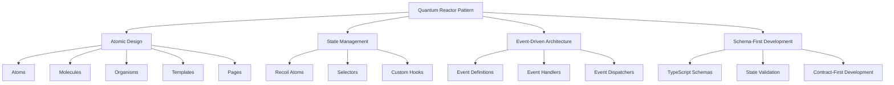

# Introduction to Quantum Reactor Pattern

::: info What is Quantum Reactor?
The Quantum Reactor Pattern is a comprehensive architectural approach to building React applications that combines atomic design, state management best practices, and event-driven architecture to create maintainable, scalable applications.
:::

Welcome to the Quantum Reactor Pattern documentation! This guide will introduce you to a cohesive architecture for building scalable and maintainable React applications.

## What is the Quantum Reactor Pattern?

The Quantum Reactor Pattern is a comprehensive approach to React application development that combines several powerful concepts:



- **Atomic Design Methodology**: Breaking UI components into atoms, molecules, organisms, templates, and pages
- **State Management with Recoil**: Using a flexible and efficient state management solution
- **Modern UI with shadcn**: Leveraging high-quality, customizable UI components
- **Event-Driven Architecture**: Creating decoupled, maintainable application flows

## Core Technology Stack

::: code-group

```tsx [Component Example]
// A simple Quantum Reactor component
import { useUserProfile } from '@/hooks/useUserProfile';
import { Avatar } from '@/components/atoms/Avatar';
import { Badge } from '@/components/atoms/Badge';

export const UserProfileCard = () => {
  const { user, isLoading, updateStatus } = useUserProfile();
  
  if (isLoading) return <Skeleton />;
  
  return (
    <Card className="p-4">
      <div className="flex items-center gap-3">
        <Avatar src={user.avatarUrl} fallback={user.initials} />
        <div>
          <h3 className="font-bold">{user.name}</h3>
          <Badge variant={user.status}>{user.statusText}</Badge>
        </div>
      </div>
    </Card>
  );
};
```

```typescript [State Management]
// Quantum state management with atoms and events
import { atom } from 'recoil';
import { UserSchema } from '@/schema/UserSchema';

// 1. Define atom
export const userAtom = atom<UserSchema>({
  key: 'userState',
  default: {
    id: '',
    name: '',
    status: 'offline',
    // ...other properties
  }
});

// 2. Create event handler
export const useUserEvents = () => {
  return useRecoilCallback(({ set }) => (event: UserEvent) => {
    switch(event.type) {
      case 'UPDATE_STATUS':
        set(userAtom, prev => ({...prev, status: event.payload}));
        break;
      // Other event handlers
    }
  });
};
```

:::

## Why Use This Pattern?

<div class="custom-container features">
  <div class="feature">
    <h4>🚀 Scalability</h4>
    <p>Easily scale from small applications to complex enterprise solutions</p>
  </div>
  <div class="feature">
    <h4>🛠️ Maintainability</h4>
    <p>Clear separation of concerns and predictable code structure</p>
  </div>
  <div class="feature">
    <h4>👨‍💻 Developer Experience</h4>
    <p>Consistent patterns that make onboarding and development faster</p>
  </div>
  <div class="feature">
    <h4>⚡ Performance</h4>
    <p>Optimized rendering and state updates</p>
  </div>
</div>

::: tip Best Practice
Quantum Reactor Pattern encourages schema-first development—always define your data structures before implementing components or state management.
:::

::: warning Common Pitfall
Avoid mixing different state management solutions. The pattern works best when using Recoil consistently throughout your application.
:::

## Who Is This For?

This pattern is designed for:

::: details Frontend Teams
- Teams building medium to large-scale React applications
- Organizations wanting to standardize their React development approach
- Projects that need to scale while maintaining code quality
:::

::: details Individual Developers
- React developers looking to level up their architecture skills
- Developers who want a structured approach to building applications
- Engineers who appreciate clean separation of concerns
:::

::: details Project Types
- Enterprise applications with complex state requirements
- Products that will grow and evolve over time
- Applications with multiple developers or teams contributing
:::

## Architectural Pillars

<div class="custom-block pillars">
  <div class="pillar">
    <div class="pillar-header">
      <div class="pillar-icon">🧩</div>
      <h3>Atomic Design</h3>
    </div>
    <p>Building complex interfaces from simple, reusable components</p>
  </div>
  <div class="pillar">
    <div class="pillar-header">
      <div class="pillar-icon">⚛️</div>
      <h3>State Management</h3>
    </div>
    <p>Clean, predictable state management with Recoil</p>
  </div>
  <div class="pillar">
    <div class="pillar-header">
      <div class="pillar-icon">📝</div>
      <h3>Schema-First</h3>
    </div>
    <p>Define data structures before implementation</p>
  </div>
  <div class="pillar">
    <div class="pillar-header">
      <div class="pillar-icon">📡</div>
      <h3>Event Handling</h3>
    </div>
    <p>Decoupled event dispatching and handling</p>
  </div>
</div>

## Getting Started

To begin your journey with the Quantum Reactor Pattern, we recommend following these guides in order:

<div class="custom-block next-steps">
  <div class="items">
    <div class="item">
      <a href="/guide/installation">
        <h4>Installation</h4>
        <p>Set up your project with all necessary dependencies</p>
      </a>
    </div>
    <div class="item">
      <a href="/guide/getting-started">
        <h4>Getting Started</h4>
        <p>Create your first application components</p>
      </a>
    </div>
    <div class="item">
      <a href="/guide/core-concepts">
        <h4>Core Concepts</h4>
        <p>Understand the fundamental principles</p>
      </a>
    </div>
    <div class="item">
      <a href="/guide/directory-structure">
        <h4>Directory Structure</h4>
        <p>Learn how to organize your code</p>
      </a>
    </div>
  </div>
</div>
